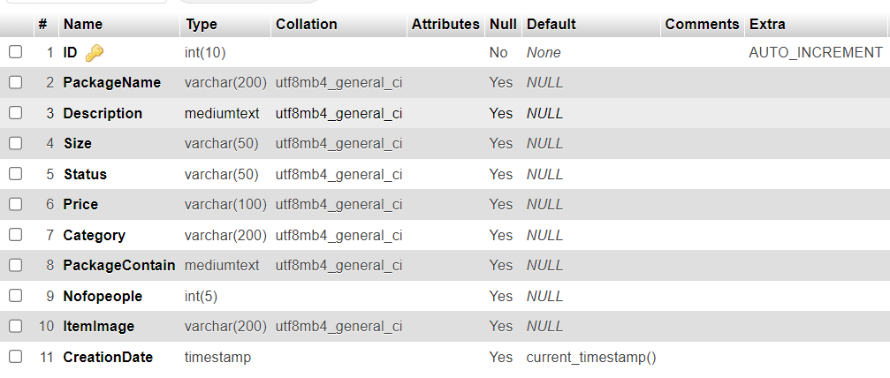
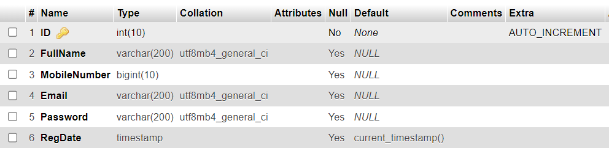
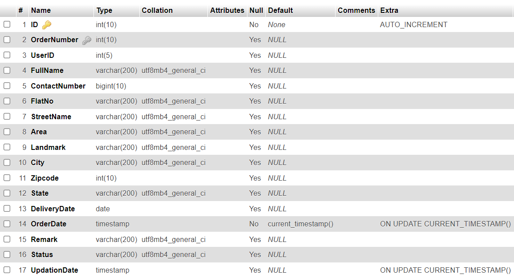
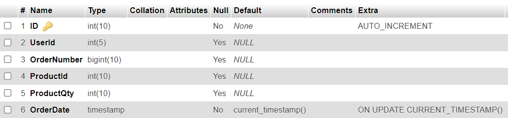

### Exercise 4 MySQL
1. Access MySQL in your terminal.
2.	Create database name dbcatering
3.	Use this newly created database to create 4 tables with the corresponding column names and data types namely:
    a.	tblfood
    
    b.	tbluser
    
    c.	tblorder
    
    d.	tblorderdetails
    

4.	Insert values on each table.
5.	Select order details based on user id and order number.
6.	Download the backup by dumping MySQL database.
7.	Attach the database in the Github repository, inside exercise-4-mysql folder

## Note: 
You may refer to the README file in the repository for more push and pull instructions